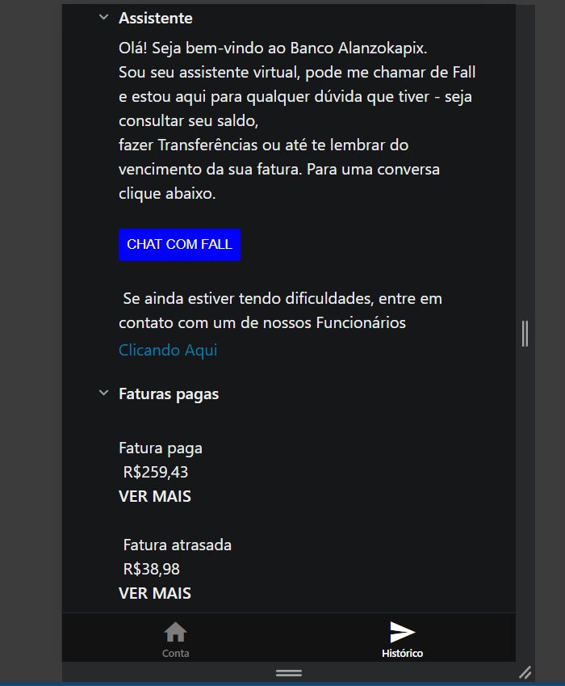

# projeto-mobile-Rafaella-Cordeiro

# Sobre o Projeto :
   Este projeto foi feito com o intuito de reproduzir o Layout de um banco genérico. Coloquei nele aspectos de coisas que gosto para passar um ar mais "eu". Nenhum banco foi copiado para faze-lo, apenas usei alguns para basear a sua organização.

# Tecnologias utilizadas :
HTML e CSS

# Prints do projeto em modo Responsivo

 

# Imagem uasada para o fundo

